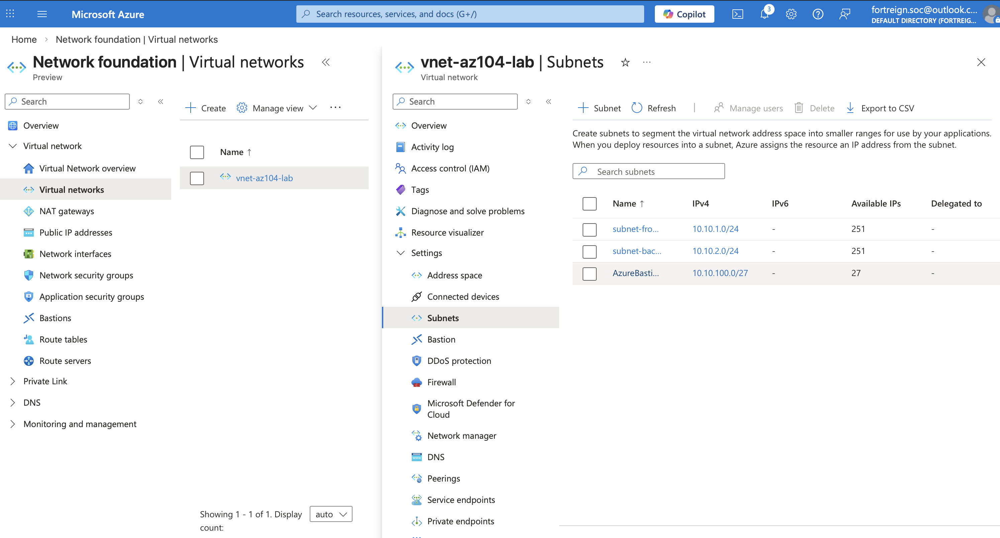

# Lab 01 — Virtual Networks and Subnets

**Analyst:** Chris Robinson  
**Date:** 2026-03-11  
**Domain:** Implement & Manage Virtual Networking (25% of AZ-104)  
**Status:** ✅ Complete  

---

## Objective

Design and deploy a three-tier Azure Virtual Network with dedicated subnets 
for frontend, backend, and secure management access using Azure PowerShell.

---

## Why This Matters

**On the exam:** VNets and subnets appear in nearly every networking scenario 
question. Address space planning, subnet sizing, and reserved IPs are 
directly tested.

**On the job:** Every Azure deployment starts with a VNet. Before a single VM, 
database, or app service goes live, the network foundation must be in place. 
This is day-one work for any cloud or sysadmin role.

**On-premises equivalent:** A VNet is your datacenter's private network. 
Subnets are the VLANs you'd configure on a managed switch — defined in 
software, routed automatically by Azure.

---

## Network Design
```
VNet:  vnet-az104-lab       10.10.0.0/16
  ├── subnet-frontend        10.10.1.0/24   (web tier — 251 usable IPs)
  ├── subnet-backend         10.10.2.0/24   (app/DB tier — 251 usable IPs)
  └── AzureBastionSubnet     10.10.100.0/27 (management — 27 usable IPs)
```

---

## Key Concepts

- Azure reserves **5 IPs** in every subnet: network address, default gateway, 
  two Azure DNS addresses, and broadcast
- A `/24` subnet yields **251 usable IPs** (256 minus 5)
- VNet address spaces cannot overlap with peered VNets or on-premises networks
- The Bastion subnet must be named exactly **`AzureBastionSubnet`** — any 
  variation will cause Bastion deployment to fail
- Azure automatically routes traffic between subnets in the same VNet — 
  no route table needed for basic intra-VNet communication

---

## Tools Used

- Azure PowerShell
- Azure Portal (verification)

---

## Lab Steps

### 1. Verify active context
```powershell
Get-AzContext
```

### 2. Confirm Resource Group
```powershell
Get-AzResourceGroup -Name "RG-AZ104-LAB"
```

### 3. Define subnet configurations
```powershell
$subnetFrontend = New-AzVirtualNetworkSubnetConfig `
    -Name "subnet-frontend" `
    -AddressPrefix "10.10.1.0/24"

$subnetBackend = New-AzVirtualNetworkSubnetConfig `
    -Name "subnet-backend" `
    -AddressPrefix "10.10.2.0/24"

$subnetBastion = New-AzVirtualNetworkSubnetConfig `
    -Name "AzureBastionSubnet" `
    -AddressPrefix "10.10.100.0/27"
```

### 4. Create the Virtual Network
```powershell
$vnet = New-AzVirtualNetwork `
    -Name "vnet-az104-lab" `
    -ResourceGroupName "RG-AZ104-LAB" `
    -Location "eastus" `
    -AddressPrefix "10.10.0.0/16" `
    -Subnet $subnetFrontend, $subnetBackend, $subnetBastion
```

### 5. Verify subnets
```powershell
(Get-AzVirtualNetwork `
    -Name "vnet-az104-lab" `
    -ResourceGroupName "RG-AZ104-LAB").Subnets `
    | Select-Object Name, AddressPrefix
```

---

## Output
```
Name               AddressPrefix
----               -------------
subnet-frontend    {10.10.1.0/24}
subnet-backend     {10.10.2.0/24}
AzureBastionSubnet {10.10.100.0/27}
```

---

## Portal Verification



---

## Exam Tips

- **Subnet sizing:** `2^(32-prefix) - 5` = usable IPs. For `/24`: 256 - 5 = 251
- **Overlap = peering failure:** Address spaces across peered VNets must be unique
- **Bastion subnet name is hardcoded** — exam will test this as a gotcha
- **No route table needed** for traffic between subnets in the same VNet
- **Subnets are regional** — a VNet does not span regions

---

## Resume Bullet

> Designed and deployed a three-tier Azure Virtual Network architecture using 
> Azure PowerShell, including dedicated subnets for frontend, backend, and 
> management tiers with a correctly sized AzureBastionSubnet for secure 
> administrative access — documented in a public GitHub portfolio.

---

## Cost

**$0.00** — Virtual Networks and subnets have no associated cost in Azure.